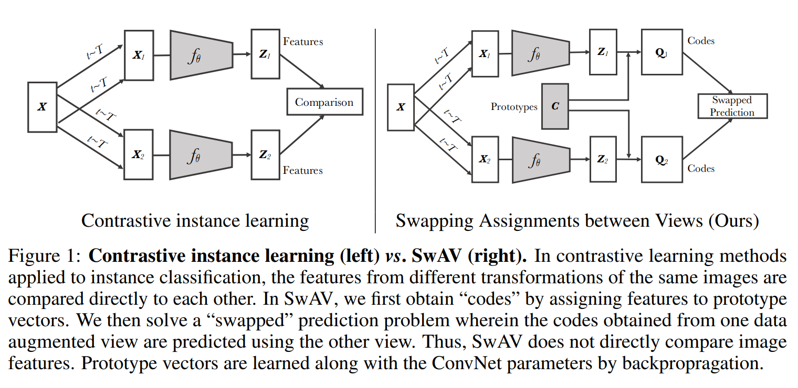

# SwAV: Unsupervised Learning Transformed to Transportation Problem using Multi-crop Technique

Paper: 

SwAV: [Unsupervised Learning Transformed to Transportation Problem using Multi-crop Technique](https://arxiv.org/abs/2006.09882)

SeLa: [Self-labelling via simultaneous clustering and representation learning](https://arxiv.org/abs/1911.05371)

> This post is now under construction. I will update it soon.

## Introduction

### Instance and Contrastive Learning

> Compare different views of the same image.

Unsupervised learning tries to learn a representation of data (etc. images) without the use of manual annotataions. In previous study, contrastive learning has been proved to be a powerful method to learn a good representation. It usually minimizes the difference between positive pairs (explicitly) and maximizes the difference between negative pairs (sometimes implicitly). 

In the absence of labels, an alternative is so-called Instance and contrastive learning, where the model minimizes the difference between 2 or more views of the same image. (e.g. SimCLR)

### Clustering-based SSL

> Assign a cluster (pseudo) label to each image.

Works show that the pseudo-label assignment problem can be transformed to an instance of optimal transport problem. The restriction in the problem ensure an equal number of samples in each cluster.

And by applying the Sinkhorn-Knopp algorithm, the problem can be solved efficiently.

## Method

In SwAV, we do not enforce the consistency between **features** of different views. Instead, focus on the **codes** of each view, the assigned cluster label.

Specifically, we generate a code (pseudo-label) by solving the optimal transport problem. Then a CE loss is applied to the code and the prediction of the code (output by a predictor after features).

### Architecture

The architecture of SwAV. The model generates 2 high resolution views and $V$ low cropped resolution views. All these views are then fed in to feature extractor. A code is generated by optimization (only for high resolution views). At the meantime, a predictor predicts a soft label using the features. Then he loss is computed between the code and the prediction.

### Loss Function

In SwAV we still use two views of an image. One for target and the other for query. "Swapped" means the target and query are swapped. The loss function is defined as:
$$
L(\mathbf{z\_t},\mathbf{z\_s}) = \mathcal{l}(\mathbf{z\_t},\mathbf{q\_s}) + \mathcal{l}(\mathbf{z\_s},\mathbf{q\_t})
$$
where $\mathbf{q}$ is the code directly computed from the target image, and $\mathbf{z}$ features from the query image.

The loss function $\mathcal{l}$ is defined as:
$$
\mathcal{l}(\mathbf{z\_t},\mathbf{q\_s}) = -\sum_k \mathbf{q\_s}^k \log \mathbf{p}^k
$$
is the cross-entropy loss between the code and the prediction of the code $\mathbf{p}$. With
$$
\mathbf{p}^k = \frac{\exp(\mathbf{q\_t}^k/\tau)}{\sum_{k'} \exp(\mathbf{q\_t}^{k'}/\tau)}
$$
where $\tau$ is the temperature.

- $\mathbf{q\_t}$ is the code of the target image. Intuitively, it should be a discrete one-hot vector. But in practice, it is a continuous vector. It is not computed by the model, but results from the optimization process. It is the output of the Sinkhorn-Knopp algorithm.
- $\mathbf{p}$ is the prediction of the code. It is based on the similarity between the code and the cluster center. It is computed by the model.

### Computing codes online

The Sinkhorn-Knopp algorithm. Only batch data is needed. The basic idea of this label assignment algorithm, or equivalently the transport problem, is to minimize the discrepancy with $\mathbf{p\_t}$ with respect to the restriction of unit mass and uniformity of $\mathbf{q\_t}$ (each cluster has the same number of samples).

### Multi-crop Augmentation

Comparing more random views can help the model capture more information about the image. However, it also casts a burden to both memory and computation.

In addition to the two views of the image discussed above, the multi-crop augmentation introduces $V$ more low-resolution crops, each only takes a small portion of the image. Lower resolution means less computation.

As described in the paper, the crops more loss terms. But here only original 2 views are computed for codes, and crops only used for prediction. This is mainly because of computational time, as well as the low-quality of the crops.

I believe this asymmetry is due to the "model complexity". If we treat the transport problem as model 1, and the prediction as model 2, then model 2 is much complex than model 1. A complex model may have the ability to restore the information using only part of images(crops), but a simple model may not. Additionally, the model 1 calculates the optimal solution, while model 2 only updates slowly. So it is reasonable to use the crops only for $\mathbf{p}$.

## Conclusion

SwAV is a refined version of SeLa(A self-labeling framework for SSL). It inherits the idea of transport problem, and introduces some techniques likes multi-crop augmentation. It is a simple and effective method for SSL.