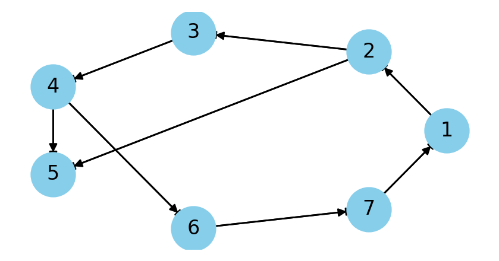

## A Brief Introduction: Network & Graph

When we talk about *network*, the first things come to our mind can be the Internet. That's right, the internet is a network, but when we mention Internet we usually refer WWW, the web pages and links, not the physical infrastructure.

WWW itself is also a network. As you can image, a network is basically consist of links and nodes. In WWW, the web pages are nodes, and the links between them are edges; A nodes can have multiple links to other nodes, and a link connects two nodes.

And this is the same as a graph. Actually, a network IS a graph. What we do is just changing the terms when we're moving from graph theory to network science. So, networks have what graphs have, and the analysis of network starts from graph theory.

By the way, there're also many examples of networks in our daily life, as long as they can be described by nodes and links. For example, 
- social networks where people follow or chat with each other
- transportation networks where cities are nodes and roads are links
- the molecular in a cell where proteins are nodes and interactions are links

## Basic Concepts in Graph Theory

### Nodes & Links

> Notations:
> - $N$: the number of nodes in a network
> - $L$: the number of links in a network
> - $k_i$: the degree of node $i$, which is the number of links connected to it

We have **undirected** and **directed** graphs. In an undirected graph, the links are symmetric, while in a directed graph, the links are asymmetric where links start from one node and end at another.

We have unigraphs and multigraphs. In a unigraph, there's only one link between two nodes at most, while in a multigraph, there can be multiple links between two nodes.

We also have weighted graphs, where the links have weights. The weights can represent the strength of the connection, the distance between nodes, or other properties. But I would like to leave this here and discuss it in far future.

#### Representations of Graphs

There're usually two ways to represent a graph: 
- **Adjacency Matrix**: a square matrix where the rows and columns are nodes, and the elements recode links.
- **Adjacency List**: a list of nodes, each record the neighbors of a node.
- **Edge List**: a list of links, each record the two nodes connected by the link.

To be concrete, let's see how these three representations store in computer. Python is used here. We use the following graph as an example:

 

##### Adjacency Matrix

Adjacency matrix is a square matrix of size $N \times N$. In a directed graph, a link from node $j$ to node $i$ is recorded as $A_{ij} = 1$. You can image that there's a link from the upper row of $A$ to the left column of $A$.


given its definition, the adjacency matrix can be utilized in matrix operations. For example,
- $A\times \mathbf{1}$ gives the degree of each node
- $(A^2)_{ij}$ is the number of paths of length 2 from node $j$ to node $i$.

##### List

Adjacency List is a list of lists. Each element in the list is a list of neighbors of a node. For example, the adjacency list of the above graph is:

```python
1 [2]
2 [3, 5]
3 [4]
4 [5, 6]
5 []
6 [7]
7 [1]
```

##### Edge List

Edge List is a collection of links. 

```python
(1, 2)
(2, 3)
(3, 4)
(4, 5)
(4, 6)
(6, 7)
(7, 1)
(2, 5)
```

##### Which one to choose?

All these representations can reconstruct the graph. They have their own advantages and disadvantages.

For **Adjacency Matrix**, it's easy to check whether there's a link between two nodes, and it's easy to perform matrix operations, which is quite useful in some algorithms. Also, Adjacency Matrix can contain more information, such as the weight of the links. However, it's not efficient in terms of memory usage. Real-world networks are usually *sparse*, which means that most elements in the matrix are zeros. Therefore, it's a waste of memory to store all zeros.

For **Adjacency List**, it's more memory-efficient. It only stores the neighbors of each node, and it's easy to add or remove a link. It's also easy to find the degree of a node. However, it fails to provides a convenient way to calculate paths between nodes.

For **Edge List**, it's like how we store sparse matrices. It's memory-efficient, and it's easy to add or remove a link. However, it's not easy to obtain the basic information of a node, such as the degree of a node. Therefore, it's not preferred in most cases.

## Quantitative Measures in Network Science

### Degree & neighbors

Degree of a node is the number of links connected to it. For a directed network, we have in-degree and out-degree.

The neighbors of a node are the nodes that are connected to it by an link.

The sum of all degrees in a network is twice the number of links, because each link is counted twice.
$$
L = \frac{1}{2}\sum_{i=1}^{N}k_i (\text{undirected network}) = \frac{1}{2}(\sum_{i=1}^{N}k_i^{in} + \sum_{i=1}^{N}k_i^{out}) (\text{directed network})
$$

### Distance & Path

The distance between two nodes is the length of the **shortest** path between them. A path is a sequence of links that connect two nodes.

The average distance of a network is the average of the shortest path between all pairs of nodes.
$$
\langle d \rangle = \frac{1}{N(N-1)}\sum_{i\neq j}d_{ij}
$$

### Degree Distribution

The degree distribution of a network is the *probability distribution* of the **degrees** over the entire network. This distribution can explain many behaviors of a network. We will discuss it very soon.

### Clustering Coefficient

Clustering coefficient measures the how the neighbors of a node are connected to each other. It is defined as ratio of links between the neighbors, and the maximum possible number of links between them.
$$
C_i = \frac{2L_i}{k_i(k_i-1)} = \frac{L_i}{k_i(k_i-1)/2}
$$

## Some assumptions in following discussions

In the following notes, unless otherwise specified, we assume that the network is or approximately be:
- **Simple**: there's at most one link between two nodes
- **Undirected**: the links are symmetric

## Supplement notions in graph theory

### Different types of graphs according to connectedness

Two nodes are connected if there's a path between them. A network is connected if there's a path between every pair of nodes. Otherwise, it's disconnected.

**Connected Component**: a subgraph in which every pair of nodes is connected by a path.

**Complete Graph**: a graph where there's a link between every pair of nodes.

***Bi-partite Graph**: a graph whose nodes can be divided into two disjoint sets $U$ and $V$, such that every link connects a node in $U$ to a node in $V$. This means that a node in $U$ can only connect to a node in $V$, and vice versa.