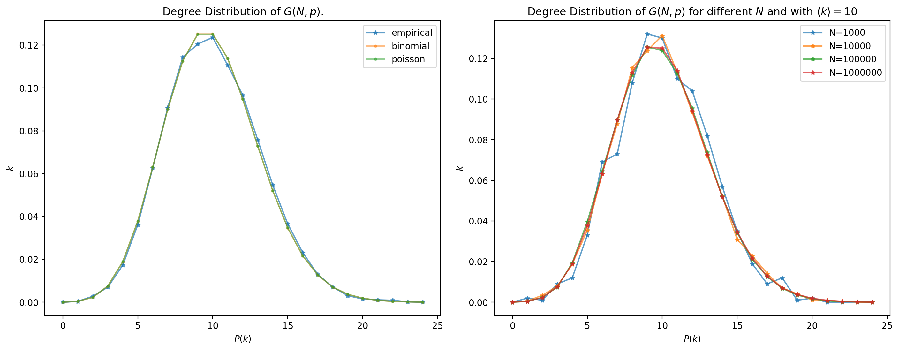
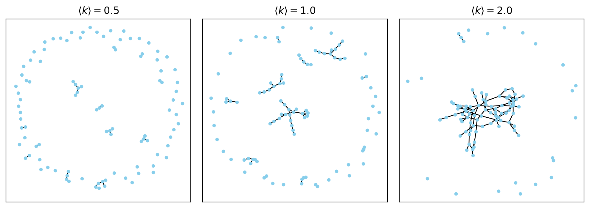
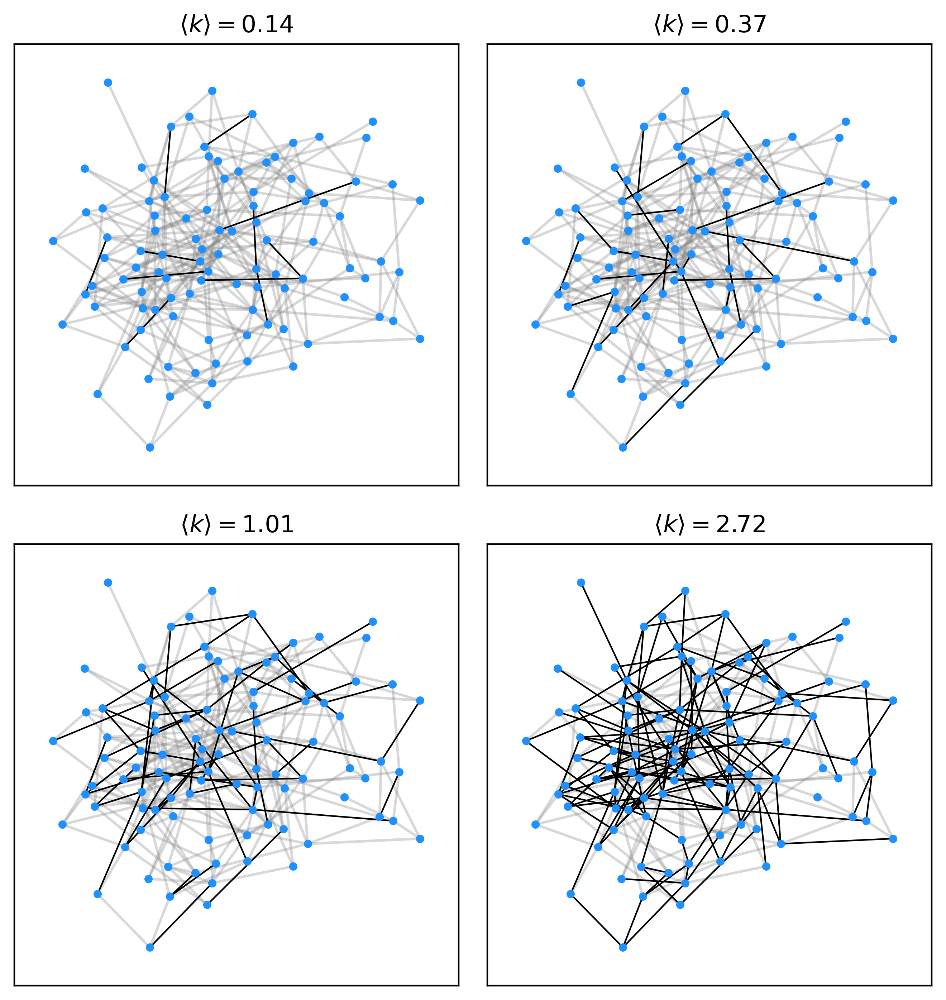
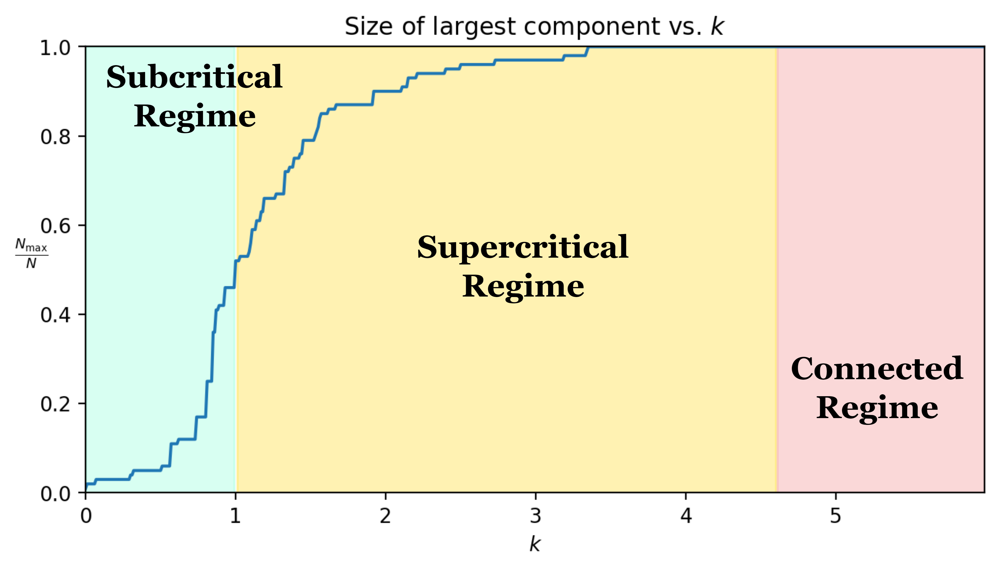

## Brainstorming: How to represent a network?

Suppose we want to share the structure of WWW with our alien friends. It is true that a adjacency matrix or a link list can represent the network, the identical one. But, is there a more concise way to represent the network? Our alien friends may not be interested in what website *Google* links to, and how they link to each other. They may only need to know there are huge hubs like *Google* and *Facebook* that connect to many other websites that has much fewer links.

In other words, how may information we need to reconstruct a *similar* network? The reconstruction need not to be the same, but it should retain all the important properties we care about.

Keep this question in mind, we will start our journey, we are now finding how we can generate a network that is similar to the real-world network. (i.e. WWW)

From the simplest network, we only utilize two parameters: $N$ and $L$.

That's how Erdős-Rényi Model comes into play.

## Building up a Random Network

A network can be built up with fixed $N$ and $L$, and it's easy to calculate the average degree of a node in the network. (i.e. $\langle k \rangle = \frac{2L}{N}$). However, I degree distribution is difficult to calculate.

Therefore, we generate a random network with fixed $N$ and probability $p$ that indicates the probability of a link between two nodes. This is the Erdős-Rényi Model. Denoted as $G(N, p)$.

## Properties of A Network

Remember we want to retain the important properties of a network. What are they? 

Consider networks with same $N$ and $L$, but different structures. We can have a network that forms many small but isolated clusters, or a network that forms a giant cluster with a few isolated nodes. We can have a network where all nodes have similar degrees, or a network where a few nodes have much higher degrees than the others, forming hubs.

Yes, we find that merely knowing $N$ and $L$ is not enough to reconstruct a network. So we add another one: the degree distribution.

### Degree Distribution

The degree distribution of a network is the probability that a randomly selected node has degree $k$. It is denoted as $P(k)$.

#### The Degree Distribution of a Random Network

The degree distribution of a random network is a Poisson distribution.

$$
P(k) = \frac{e^{-\langle k \rangle} \langle k \rangle^k}{k!}
$$

where $\langle k \rangle$ is the average degree of a node in the network.

Let's see how the distribution is derived.

For any node in G(N, p), every other node has a probability $p$ to connect to it. Therefore, the degree of a node follows a binomial distribution.

$$
P(k) = \binom{N-1}{k} p^k (1-p)^{N-1-k}
$$

When $N$ is large, we can approximate the binomial distribution with a Poisson distribution. (See [appendix](#proof-of-poisson-approximation) for the proof)

Let's see how the Poisson distribution looks like.

Additionally, this distribution is **stationary**. That is, the distribution does not change with time, or change with the size of the network. In right figure above, we can see that the distribution of a network with $N=1000$ is similar to the distribution of a network with $N=10000$.

#### Scaling of $G(N, p)$

The 'scaling' of a network can be the momentum of the degree distribution. i.e. the average degree and the variance of the degree distribution.

Approximating the binomial distribution with a Poisson distribution, $\langle k \rangle$ and $\sigma^2$ can be calculated by

$$
\langle k \rangle = (N-1)p \approx Np
$$

$$
\sigma = \langle k \rangle ^{1/2} \approx (Np)^{1/2}
$$

Due to a relatively small variance, all degrees are concentrated around the mean, forming a peak in the distribution.

#### The Degree Distribution of a Real-world Network

However, the degree distribution of a real-world network is **not** a Poisson distribution. It is a power-law distribution, which we will discuss in the next note.

**Why hubs are missing in a random network?**

Hubs are large nodes that connect to many other nodes. In a random network, we don't see hubs. 

Intuitively, how we generate a random network promising that every node is equally likely to connect to any other node. The symmetric property of a random network makes it impossible to form hubs.

Numerically speaking, the degree distribution of the network is a Poisson distribution, which has a tail that decays faster than a exponential distribution. Preventing the formation of hubs.

### When is G(N, p) connected?

Figure below shows random networks with $\langle k \rangle = 0.5, 1, 2$.

Some observations are made:
- For a small $\langle k \rangle$, the network is likely to be disconnected.
- For a large $\langle k \rangle$, most of the nodes are connected to each other.
Some questions are raised:
- Is there a critical point where the network is likely to be connected?
- How is the network connected?

In this section, discussions are made on how $\langle k \rangle$, affects the connectivity of a network. 

Conclusively, $\langle k \rangle$ divides the network into three regions:
- $\langle k \rangle < 1$: The network is in **subcritical** regime/phases. The network is likely to be disconnected.
- $\langle k \rangle = 1$: The network is in **critical** regime. The network forms some clusters, but their relative size is still zero.
- $\langle k \rangle > 1$: The network is in **supercritical** regime. The network is likely to be connected.

Here we conduct an experiment. First, we generate $N(N-1)/2$ random numbers from Uniform(0, 1), indicating the probability of a links between all node pairs. Then, we gradually increase $\langle k \rangle$, and see how the network "grows" into the final connected network.

And here is another plot showing the relative size of the largest cluster in the network, $\frac{N_{\text{max}}}{N}$.

### Small-world Property

## How to Generate a Random Network?

## Supplementary Notes

#### Proof of Poisson Approximation