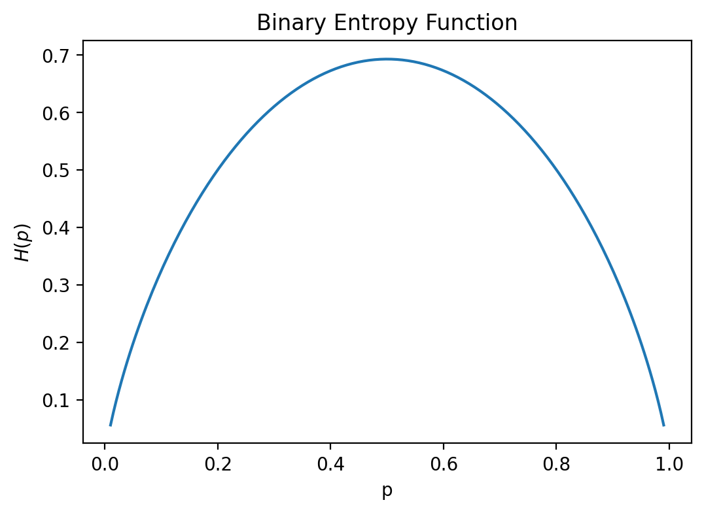

## Introduction

Entropy discussed here is different from the entropy in thermodynamics. Entropy in thermodynamics is a measure of the disorder of a system. Entropy in information theory is a measure of the **uncertainty** of a random variable, or the **average information** of a random variable.

For Machine-Learning learners, if you are not interested in the mathematical details, you can skip the next two sections and go to the section of "Cross Entropy".

## Entropy

[Entropy](https://en.wikipedia.org/wiki/Entropy_(information_theory)) is a measure of the "self-inofrmation". It is defined as:
$$
H(X) = -\sum_{x\in X}p(x)\log p(x)
$$
where $X$ is a random variable, $p(x)$ is the probability of $x$.

### Intuition
As mentioned, entropy is a measure of the uncertainty of a random variable. The more uncertain the random variable is, the higher the entropy is.

: Example1 - Consider a coin and a 6-face dice. The coin has two outcomes, head and tail, each with probability $0.5$. The dice has six outcomes, each with probability $1/6$. The entropy of the coin is:
$$
H(\text{coin}) = -0.5\log 0.5 - 0.5\log 0.5 = 1
$$
The entropy of the dice is:
$$
H(\text{dice}) = -\frac{1}{6}\log{\frac{1}{6}}\times 6 = 2.58
$$
The entropy of the dice is higher than the entropy of the coin, which means the dice is more uncertain than the coin.

: Example2 - Consider a biased coin with probability $p$ of head and $1-p$ of tail. The entropy of the biased coin is:
$$
H(\text{biased coin}) = -p\log p - (1-p)\log(1-p)
$$
draw the entropy of the biased coin as a function of $p$:

That's what we expect for the uncertainty of a biased coin. If the coin is fair, we can not tell which outcome it will be, so the entropy is high. If the coin is biased, we can tell which outcome it will be, so the entropy is low.

The concept of "information" related to entropy is abstract, and I afraid my explanation is not clear enough. You can refer to the Wikipedia page for more details.

## KL Divergence

[Kullback-Leibler divergence](https://en.wikipedia.org/wiki/Kullback%E2%80%93Leibler_divergence) is a measure of the difference between two probability distributions. It is defined as:
$$
D_{KL}(P||Q) = \sum_{x\in X}p(x)\log\frac{p(x)}{q(x)}
$$
where $P$ and $Q$ are two probability distributions, $p(x)$ and $q(x)$ are the probabilities of $x$ in $P$ and $Q$ respectively.

## Cross Entropy

In machine-learning, cross-entropy is used to measure the difference between two probability distributions. It is defined as:
$$
H(P, Q) = -\sum_{x\in X}p(x)\log q(x)
$$
where $P$ and $Q$ are two probability distributions, $p(x)$ and $q(x)$ are the probabilities of $x$ in $P$ and $Q$ respectively.

### Some explanations
**Q1**: The loss is asymentric, can we swap $P$ and $Q$?

**A1**: No. 1. If we compare true *binary* labels with predicted *binary* labels, $\log (0)$ is met. 

**Q2**: Why do we use cross-entropy loss for binary classification and not mean squared error?
**A2**: Placing the true labels at $p(x)$ can greatly simplify the calculation of the gradient. (See [this post](https://stackoverflow.com/questions/41990250/why-do-we-use-cross-entropy-loss-for-binary-classification-and-not-mean-squared) for more details.)

