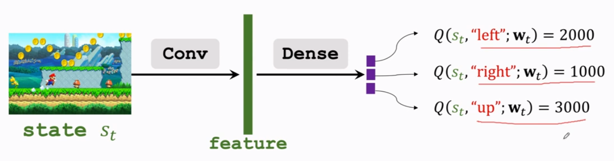

# Value-based Learning

> credit:
>
> [Bellman equation - Wikipedia](https://en.wikipedia.org/wiki/Bellman_equation)
>
> [Temporal Difference Learning - 知乎 (zhihu.com)](https://zhuanlan.zhihu.com/p/57836142)
>
> [蒙特卡洛梯度估计方法（MCGE）简述 - 知乎 (zhihu.com)](https://zhuanlan.zhihu.com/p/81806149)
>
> [强化学习 - 时间差分学习(Temporal-Difference Learning) - 知乎 (zhihu.com)](https://zhuanlan.zhihu.com/p/73083240)

## Outline

### Goal of RL

Win the game. It can be described by maximizing the expected return.

### Challenge

Q1. How to choose an action with better return as $U_t$ is random variable?

A1. Expectation. The action-value function use expectation to remove the influence of future randomness.

Q2. How can I choose currently best action if we had known $Q^*$, the optimal value function?

A2. Choosing the action with greatest $Q\^\*$. $a^* = \arg\max\limits_{a}Q^*(s,a)$.

Q3.How to learn $Q^*$? Is it learnable?

A3. At least a neural network $Q^*(s,a;\mathbf{w})$ can be used to approximate it.

## TD (Temporary Difference)

> TD Learning is a combination of **Monte Carlo** ideas and **Dynamic Programming** (动态规划) ideas.
>
> TD learning samples from incomplete discrete episode (Sequence of states) and utilize bootstrapping. It estimates the expected return of such episode, then updates the value of state by discounted new value estimation. The model repeats renewing the estimated state-value function the progress to by sampling. 
>
> Much like Monte Carlo, TD learning learns from experience. While Monte Carlo methods only adjust their estimates once the final outcome is known, TD methods adjust predictions to match later, more accurate, predictions about the future before the final outcome is known. This is a form of bootstrapping.

Review that Bellman Equations:

1. State-value function under policy:

$$
\begin{aligned}
V_\pi(s)=\sum_a\pi(a|s)\sum_{s',r}p(s',r|s,a)[r+\gamma V_\pi(s')]
\end{aligned}
$$

​	 is the expected value of state $s$ under policy $\pi$. The first summation is over all possible actions $a$ that can be taken from state $s$ under policy $\pi$. The second summation is over all possible outcomes $s'$ and rewards $r$ that can follow the state-action pair $(s,a)$. Remember that the value in n-steps later is discounted by $\gamma^n$.

2. Action-value function:

$$
\begin{aligned}
Q_\pi(s,a)=&\sum_{s',r}p(s',r|s,a)[r+\gamma \sum_{a'}p(a'|s')Q_\pi(s',a')]\\\\
=&\sum_{s',r}p(s',r|s,a)[r+\gamma V_\pi(s')]
\end{aligned}
$$

​	is the expected value of state $s$ and action $a$ under policy $\pi$. The state-value function can be rewrited as $V_\pi(s)=\sum_a\pi(a|s)Q_\pi(s,a)$.

3. Bellman optimal equation:
   $$
   \begin{aligned}
   V_{\pi^*}(s)&=V(s)\\\\
   &=\max\limits_{a}\sum_{s',r}p(s',r|s,a)[r+\gamma V(s')]
   \end{aligned}
   $$
   describes a overall state-value, it also represent the state-value under the **best** policy, making the best action all the time. It's also recursive. And note that $V(s)$ is different from $V_\pi(s)$.

4. Action-value function under optimality:
   $$
   \begin{aligned}
   Q(s,a)&=Q^*(s,a)\qquad \text{(notation in Note1)}\\\\
   &=\sum_{s',r}p(s',r|s,a)[r+\gamma \max\limits_{a'}Q(s',a')]\\\\
   &=\sum_{s',r}p(s',r|s,a)[r+\gamma V(s')]
   \end{aligned}
   $$

  It can be interpreted as taking action $a$ in state $s$, then following the optimal policy afterwards.

I mention 3 relate algorithms: Monte Carlo, Dynamic Programming and TD learning. TD is a combination of the first two.

However, three algorithm vary in their requirements for **environment dynamics** and **depth of backup**(length of state sequence).

- Monte Carlo: no requirement for environment dynamics, full backup.
- Dynamic Programming: full knowledge of environment dynamics, full backup.
- TD learning: no requirement for environment dynamics, sample backup.

### Monte Carlo

#### Short introduction

Monte Carlo estimate the gradient of objective function $F(\theta)$ by sampling (observations)
$$
\eta=\nabla_\theta E_{p(x,\theta)}[f(x;\phi)]\sim\frac{1}{N}\sum^N_{n=1}f(x_n;\theta^{(i)})
$$
Different from deterministic optimization, Monte Carlo contains randomness from two parts:

-  In simulation, since the (environment) model $F(\theta)$ is non-deterministic, its gradient and Hessian matrix at $x$ are also random.
-  While optimization, technique like minibatch or stochastic gradient descent introduce randomness.  

#### Monte Carlo in Q-learning

To obtain the return of whole episode
$$
G_t=\sum_{i=0}^T\gamma^iR_{t+i}
$$
In Monte Carlo we evaluate $V(s)$, then update the estimation
$$
V(S_t)\leftarrow V(S_t)+\alpha\frac{1}{N(S_t)}(G_t-V(S_t))
$$
where $\alpha$ is the step size of estimated gradient. $N(S_t)$ is the number samples of state $S_t$.

The above iteration can be also viewed as optimize a $L_2$-loss between $V(S_t)$ and $G_t$, the estimated return and the real return from time $t$ to the end of episode. From the expression, we can know that

**First**, Monte Carlo algorithm requires the knowledge of the whole episode. It can't update the estimation until the episode ends.

**Second**, it doesn't require the knowledge of environment dynamics. We don't need to know how states are transited. It only needs the reward and state sequence.

### Dynamic Programming

Dynamic Programming refers to a collection of algorithms that can be used to compute optimal policies given a perfect model of the environment as a Markov decision process (MDP). 

DP uses full backup. In each iteration, the algorithm considers all possible state next one (or several) step(s), and take the expectation of it rather than sample one of them. Then current best choice is determined. 
The value function used by DP is:
$$
V(S_t)=E_\pi[R_{t+1}+\gamma V(S_{t+1})]
$$
It is also recursive. Since it is rarely possible to fully search for all possible states, greedy algorithm is often used. 

### Temporary Difference

 The difference for MC and TD lies in the objective, or they loss function for parameter updates. The simplest form of TD is TD(0). TD(0) used the difference of value at time $t$ and value at time $t$ considering reward $R_t$. The update rule is:
$$
V(S_t)\leftarrow V(S_t)+\alpha(R_t+\gamma V(S_{t+1})-V(S_t))
$$
Here we subsitute the real return $G_t$ with the estimation $R_t+\gamma V(S_{t+1})$. $R_t$ is the observed reward at time $t$, and $V(S_{t+1})$ is the estimation of value at time $t+1$. The difference between them is the **TD error**.
> I prefer to understand TD as comparing $V(S_t)$ with $V(S\_t)|\_{S_{t+1}}$, the value of state $S_t$ given the next state $S_{t+1}$.

It only takes 1 step forward, making no requirement for the realization of further step. This is where TD outstrips Monte Carlo: it does not need to wait until the end of episode.

To expand TD(0) to TD(n), we actually take $n=0,1,2,...,\infty$ step forward, defining

$$
G^{(n)}\_t = \sum_{i=0}^nR_{t+i}+\gamma^nV(S_{t+n})
$$

with expanded update rule:
$$
V(S_t)\leftarrow V(S_t)+\alpha(G^{(n)}_t-V(S_t))
$$

> As $n\leftarrow\infty$, TD(n) is equivalent to Monte Carlo.

## Deep Q Network (DQN)

 DQN tries to approximate the optimal value function $Q^*$ by a neural network $Q(s,a;\mathbf{w})$. The input is the state $s_t$, and the output are the score of all available actions.

The model structure can be variant.

Rewrite the update rule of TD in backpropagate manner:

- Loss: $L = \frac{1}{2}(q-y)^2= \frac{1}{2}(Q(s_t)-G_t)^2$

- Gradient: $\nabla_{\mathbf{w}}L=\frac{d~L}{d~ \mathbf{w}}=\frac{d~ L}{d~ q}\cdot \frac{d~ q}{d~ \mathbf{w}}=(q-y)\frac{d~ Q(\mathbf{w})}{d~ \mathbf{w}}$

- Gradient descent: $\mathbf{w\_{t+1}}=\mathbf{w\_{t}}-\alpha\cdot\nabla\_\mathbf{w}L|\_{\mathbf{w=w_{t}}}$

  The Loss is also called TD error $\delta$. Where $q$ is the estimation of $Q(s_t)$, and $y$ is the target value.