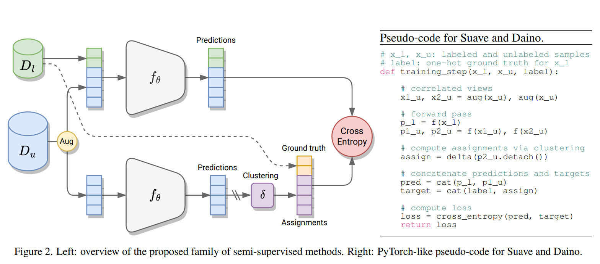
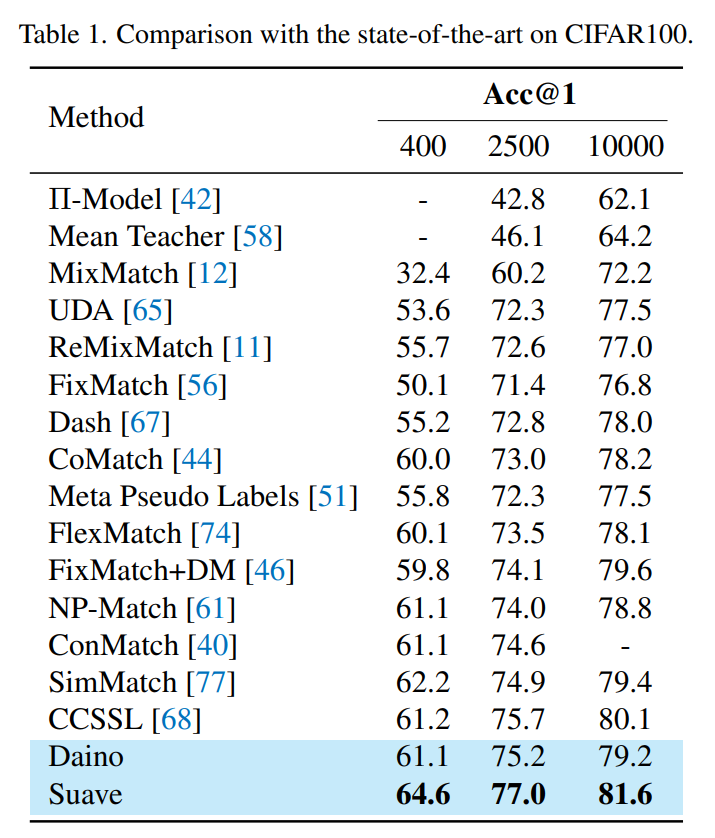
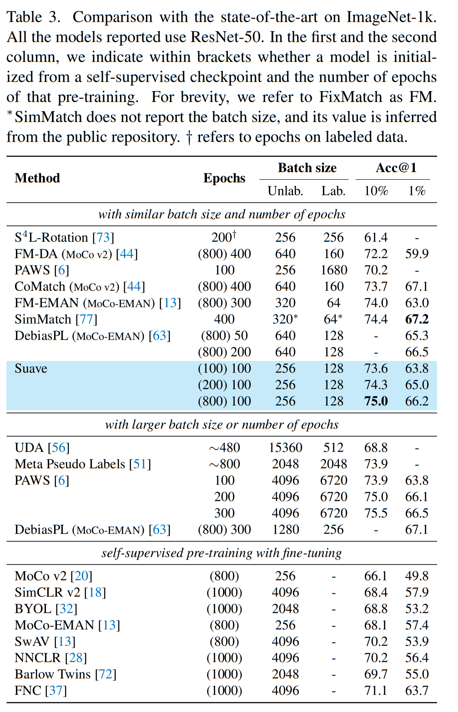
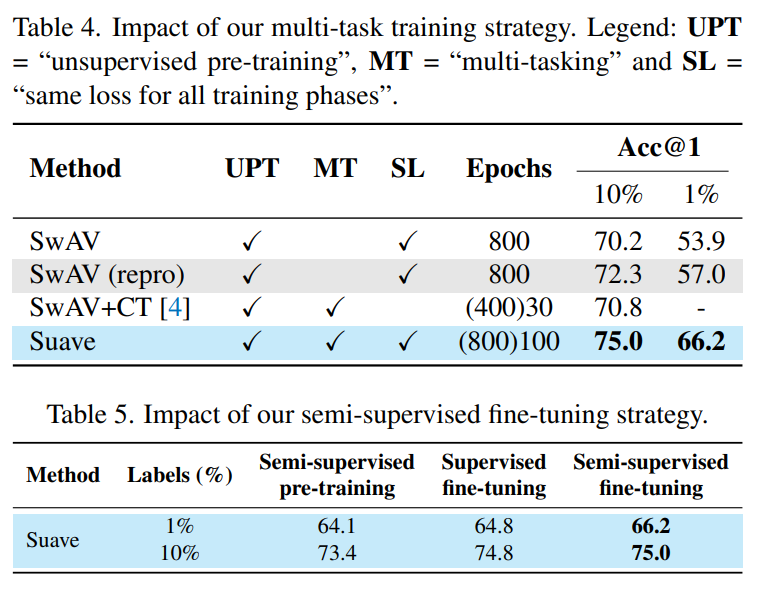

paper: [Semi-supervised learning made simple with self-supervised clustering](https://arxiv.org/abs/2306.07483)

# Cluster-based SSL: Aligning Clusters with Labeded Data

## Introduction

 Cluster-based self-supervised method has been shown to be powerful in representation learning. Works like [SwAV](https://arxiv.org/abs/2006.09882) and [MoCo](https://arxiv.org/abs/1911.05722) have shown that the learned representations in an effective way. In downstream tasks, such methods can achieve comparable performance with supervised learning.

 However, the clusters learned by these methods are often inconsistent with the labeled data. For example, SwAV assigns a pseudo label to each cluster, but the pseudo label is not consistent with the labeled data. The pseudo label just represents a optimization of the loss function. In some cases, dogs of different breeds may be assigned to the different clusters. In this case, the learned clusters are not consistent with the labeled data.
 
 This paper directly aligns the clusters with the labeled data, using SOTA framework in Supervised Learning.

## Method

The idea of this paper is simple. It uses a supervised loss to align the clusters with the labeled data. Simply append it to the loss function of the cluster-based SSL method.

## Results

### Comparision with Consistency SSL

Compared with consistency SSl, which focus on the consistency regularizaiton in SSL, this method is outperformed the strong baseline.

### Compare with SOTA model on ImageNet

Here the method is compared with three types of SOTA models on ImageNet: Small-batch semi-supervised learning like [FixMatch](https://arxiv.org/abs/2001.07685), Large-batch semi-supervised learning methods and self-supervised learning methods with fine-tuning. 

The method outperforms most of the methods in the semi-supervised learning methods.

### Compare with backbones method with labeled data

Here one of the multi-task model, Suave is compared with SwAV and its semi-supervised version, SwAV+CT. "Multi-task" means the model is trained with losses from both labeled data and unlabeled data. 

From the table, Suave is not only better that its basis, but also better than SwAV+CT. This shows that the framework of this paper is effective for combining cluster-based self-supervised learning with labeled data.

## Conclusion

In this paper the main idea is simple and clear. An supervised loss is added together with the unsupervised loss in the cluster-based SSL pretraining.

The paper provides an example that the self-supervised learning based on clustering can be combined with labeled data, acting as an semi-supervised learning method.