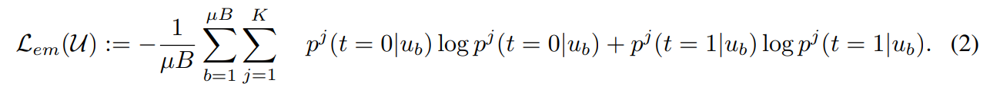
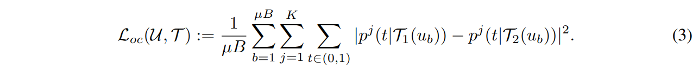
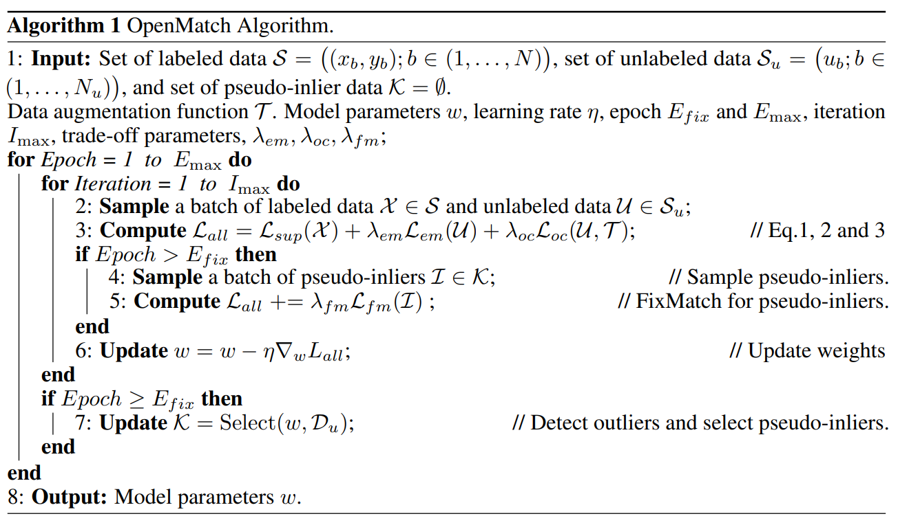
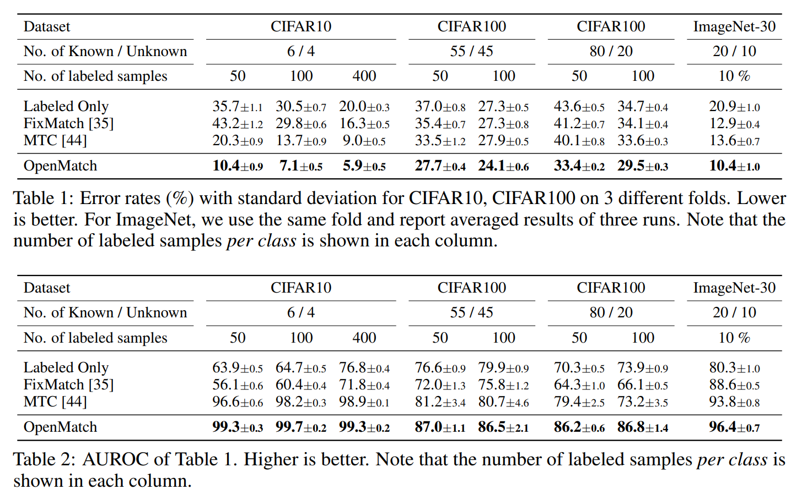
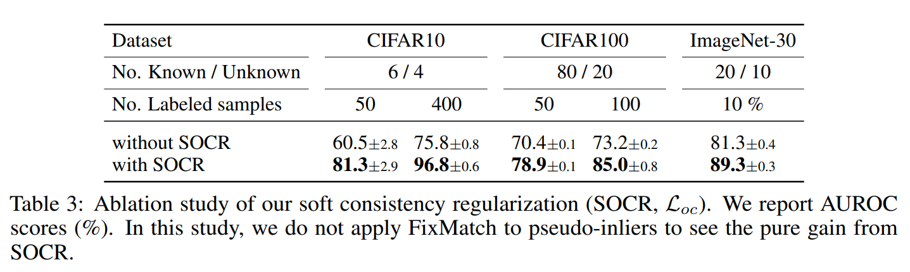
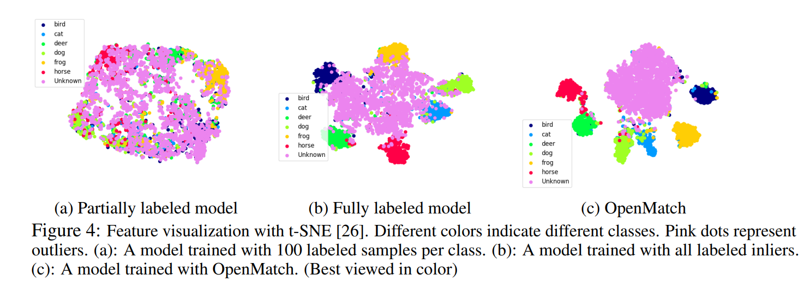

# OpenMatch: Learn a Outlier Dectector to Enhance FixMatch

Paper: [OpenMatch: Open-set Consistency Regularization for Semi-supervised Learning with Outliers](https://arxiv.org/abs/2105.14148)

> This post is now under construction. I will update it later.

## Introduction

Semi-supervied learning utilizes unlabeled data to improve the performance. It usually propagates the class information from labeled data to unlabeled data, called *pseudo labelling* (PL), which significantly improves the performance of model without additional labeled cost. A common assumption of SSL is the identical distribution of both labeled and unlabeled data. But in practice, this assumption is easily violated i.e. unlabelled data may contain unknown classes. Data points from unknown classes are called *outliers*, in contrast to *inliers* from known classes. Outliers can lead to a significant performance drop of SSL.

We are now focusing on a task called *open-set Semi-supervised Learning* (OSSL). In this task, the training data is composed of labeled data and unlabeled data. The labeled data is composed of known classes, while the unlabeled data is composed of known classes and unknown classes. In this paper, OpenMatch proposes a framwork to detect then remove outliers from unlabeled data. OpenMatch can be viewed as a enhancement of FixMatch, a more robust one w.r.t. open-set.

## Related Work

### Semi-supervised Learning

Methods like FixMatch and UDA combine data augmentation and PL show great performance on benchmarks. However, their performances drop when a model is exposed to noisy unlabeled data that contains outliers.

### Open-set SSL

> I should carefully read following papers then write a summary, later.

Open-set SSL methds include MTC, D3SL, and UASD.

- MTC updates the network parameters and the anomaly score of unlabeled data, alternatively.
- D3SL selects unlabeled data to optimize SSL loss as well as optimizing a function to select inliers.
- UASD generates soft targets of the classifier for inliners by averaging over many temporally ensemble networks's prediction.

### Novelty Detection

Novelty detection is a task to detect outliers, unseen during training. Self-supervised learning such as rorarion prediction and contrastive learning can be useful to sepreated inliers and outliers. However in OSSL, a model does not have plenty of labeled samples.

## Method
There are elementary 3 components in OpenMatch: a shared feature extractor $F$, an outlier detector (consist of $K$ one-vs-all sub-classifiers $D^j$), and a closed-set classifier $C$ for inliers. When it comes to test, the model follow the following steps: (1) closed-set classifier $C$ predicts the class of a test sample from $K$ classes, said $\hat{y}$; (2) Then if outlier detector $D^{\hat{y}}$ predicts the sample as outlier, the sample is rejected. Otherwise, the sample is accepted.

The main novelty of OpenMatch is
- The choice of OVA-classifier $D^j$.
- Training with solf open-set consistency regularization

### Overview

OpenMatch's training loss consists of 3 parts: 

(1) supervised hard-negative loss $\mathcal{L}_{ova}(\mathcal{X})$ 

(2) Open-set Entropy loss $\mathcal{L}\_{em}(\mathcal{U})$ 

(3) Soft Open-set consistenecy regularization $\mathcal{L}\_{oc}(\mathcal{X,T})$.

#### 1. Supervised Hard-Negative Loss

The key of supervised hard-negative loss is that each sub-classifier outputs a distance from the corresponding class. The loss is defined as follows:

This technique is proposed by Saito *et al.* in [Open-Set Domain Adaptation by Backpropagation](https://arxiv.org/abs/1804.10427). The intuition is that the distance from the correct class should be smaller than the distance from other classes. The loss is minimized when the distance from the correct class is smaller than the distance from other classes.

#### 2. Open-set Entropy Loss

The open-set entropy loss is defined as follows:

The intuition is that the entropy of the output of the sub-classifier (outlier detector) should be high. The sub-classifier should separate inliers and outliers well.

#### 3. Soft Open-set Consistency Regularization

This is the main novelty of OpenMatch. The loss is defined as follows:

The intuition is that the output of the sub-classifier should be consistent with the augmentation. It ensures the smoothness w.r.t. augmentation $\mathcal{T}$. Different from previous soft consistency regulazation, OpenMatch uses the output of the outliers detector to compute the loss. (*i.e.* In SimCLR, the output of the encoder is used to compute the loss.)

Loss 2 and 3 are used to train the outlier detector. They can be seen as a regularization to the outlier detector. The outlier detector is trained to separate inliers and outliers well, and the closed-set classifier is trained to classify inliers well.

### Classifier cross-entropy loss

The above 3 losses are all used to train the outlier detector. The closed-set classifier is trained using standard cross-entropy loss, named $\mathcal{L}_{cls}(\mathcal{X})$. After pseudo-labelling, the closed-set classifier is trained on both labeled data and pseudo-labeled data.

### Framework

OpenMatch Algorithm is shown in the following figure.

Compare to FixMatch, OpenMatch roughly has two stages:

In the first stage ($Epoch<E_{fix}$), we (1) regulize the outlier detector on both labeled data (equ.1) and unlabeled data (equ.2&3) (2) train $C$ on labeled data using standard cross-entropy loss. 

In the second stage ($Epoch\geq E_{fix}$), some unlabeled data is selected as pseudo-labeled data, and a corresponding loss is added. The pseudo-labeled data is then used in a **FixMatch**-like manner, minimizing the loss $\mathcal{L}_{fm}(\mathcal{I})$ between weak and strong augmentations.

Here $E_{fix}$ is a hyper-parameter, we hope that the outlier detector is well-trained before we start to use pseudo-labeled data.

Finally, the ultimate loss is defined as follows:

$\mathcal{L}=\mathcal{L}\_{sup}(\mathcal{X})+\lambda\_{em}\mathcal{L}\_{em}(\mathcal{X})+\lambda\_{oc}\mathcal{L}\_{oc}(\mathcal{X,T})+\lambda_{fm}\mathcal{L}\_{fm}(\mathcal{I})$

where $\mathcal{L}\_{sup}(\mathcal{X})$ is the sum of $\mathcal{L}\_{ova}(\mathcal{X})$ and $\mathcal{L}\_{cls}(\mathcal{X})$, the standard cross-entropy loss on labeled data.

## Results

### Comparison with other methods

OpenMatch is compared with 3 models: MTC, FixMatch (on open-set), and classifier trained on labeled data only. The hyper-parameters for all models are the same. The results are shown in the following table.  

In both classification task and anomaly detection task, OpenMatch outperforms other methods. In the anomaly detection task, OpenMatch achieves 0.5% higher AUROC than MTC. In the classification task, OpenMatch achieves 0.5% higher accuracy than FixMatch.

OpenMatch significantly improves performance of FixMatch, which can have a poor performance when the unlabeled data contains outliers. However, compared to closed-set FixMatch, which has an accuracy of 11.39%, 5.07% and **4.31%** with 4, 25 and **400** labeled data in each class. Also, FixMatch achieves an accuracy of about 23% on CIFAR-100, 100 labels per class.

As for outlier detection, OpenMatch achieves higher AUROC in these benchmarks.

#### A counter-intuitive phenomenon

As reported in paper, the error rate of classification rises as the ratio of inliers increases (Table 1). This phenomenon is somehow counter-intuitive. Not only OpenMatch, but all other three methods also have a better performance when the ratio of outliers is close to inliers'. 

### Ablation study of SOCR

The ablation study of SOCR is shown in the following table. The results show that SOCR is important for the performance of OpenMatch.

Again, the error rate of classification rises as the ratio of inliers increases. This might related to imbalance. The ratio 55/45 is more balanced than 80/20, this may account for the better performance.

The difference in performance can be explained by their resistance to augmentation: The loss between weak & strong augmentation in FixMatch enhances its resistance, and the SOCR is again comparing between two augmentations, which also enhances its resistance. With an invariance to augmentation, the difference detected by the model should be mainly caused by the difference between inliers and outliers.

### Representation learning

Above procedure not only train a classifier and a outlier detector, but also learn a representation. In contrast to FixMatch, OpenMatch regulizes the distance between the inliers and outliers; in contrast to contrastive learning (*i.e.* SimCLR), OpenMatch can use labeled data to cluster inliers.

OpenMatch learns a representation that separates inliers and outliers, considering outliers as another class. The t-SNE visualization of the representation is shown in the following figure. The outliers are well separated from inliers.

## temporary notes

### Discussion

- Top k
- add unknown class as local outlier and global outlier
- A large number of classes will not affect the performance of the model, only about computational cost

### Some thoughts

1. The visualization of representation of OpenMatch shows its strategy: it treats outliers as a broadly distributed class, and inliers as a class with a small variance. The representation is learned to separate inliers and outliers. If we preset a class for outliers, and allow it to have a larger variance, could we get a similar result?
2. Compare (b) and (c) in above figure. Just omit the difference in # of labeled sample, we can view (b) as a representation learned without unknown class, and (c) a representation learned with unknown class. The difference is that (c) has a better separation between inliers and outliers. Experimentally, we can verify this by running OpenMatch with full label.
3. From the perspective of regulization. There is a intuitive idea to learn a possible representation that not only separate inliers, but also separate outliers. If so, to learn a classifier for both inliers and outliers, we need to find a regulization that can separate different classes, even with the absence of labels. But what is it?